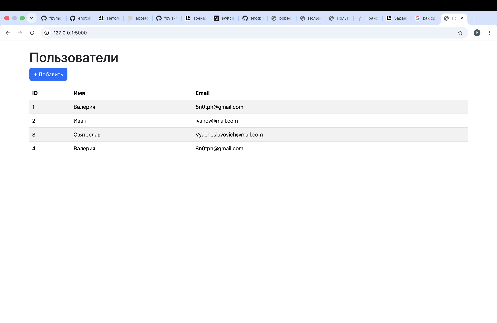
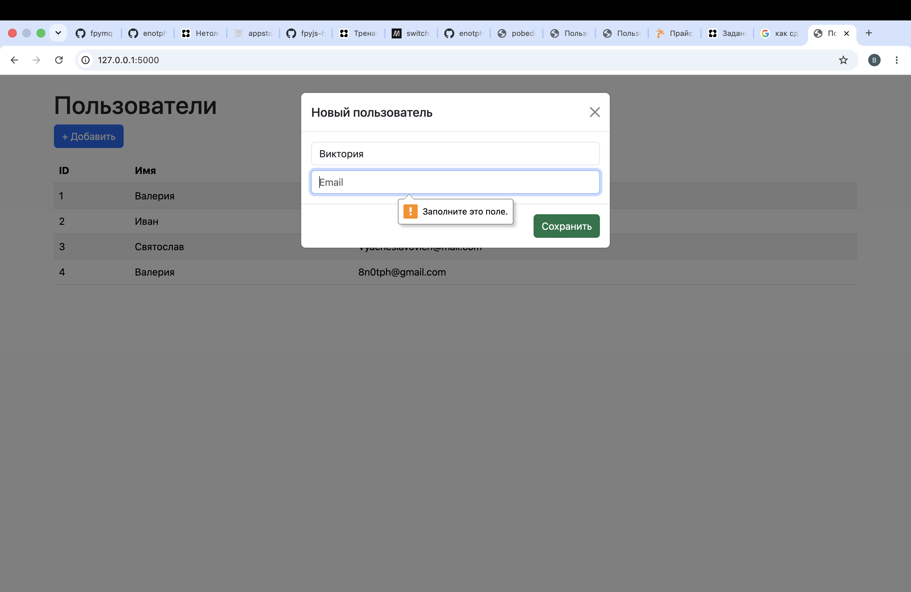
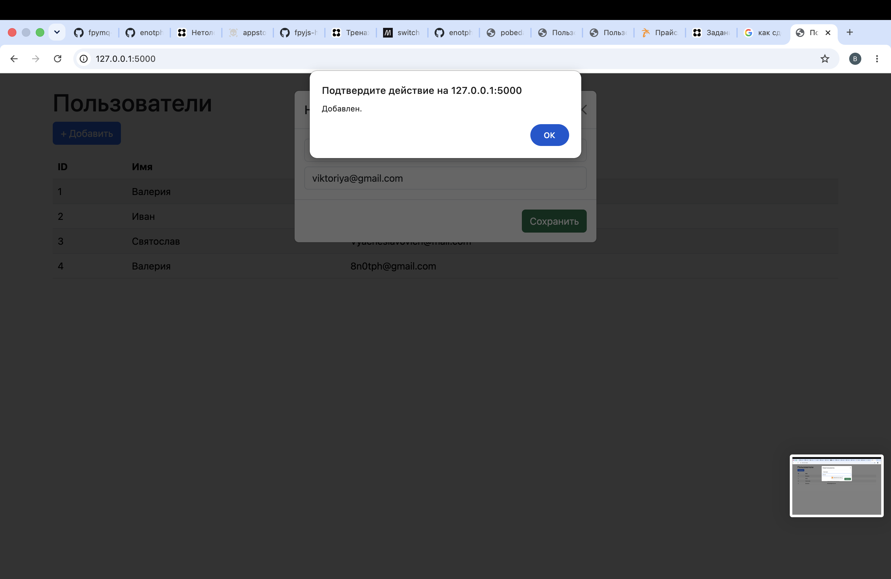
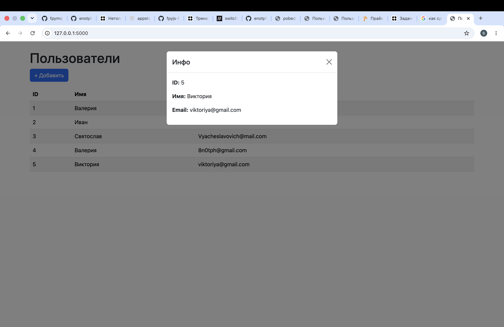

## Используемые технологии

* **Python 3.10+**
* **SQLAlchemy** — ORM для работы с базой данных
* **Flask** — микрофреймворк для создания веб-приложений
* **Bootstrap 5** — фронтенд-фреймворк для стилизации и адаптивной вёрстки
* **Vanilla JavaScript + Fetch API** — динамическое взаимодействие с бэкендом без перезагрузки страницы

---

## Логика работы

1. Пользователь открывает в браузере адрес http://localhost:5000.
2. Flask отдаёт index.html с подключёнными Bootstrap и script.js.
3. JavaScript делает GET /users через Fetch API и получает список пользователей в формате JSON.
4. Данные динамически отображаются в таблице без перезагрузки страницы.
5. При клике на строку таблицы открывается модальное окно с детальной информацией о пользователе.
6. При нажатии «+ Добавить» открывается форма, которая отправляет POST /users с данными (name, email).
7. Бэкенд сохраняет пользователя в SQLite и возвращает созданный объект.
8. Фронтенд получает ответ, показывает уведомление и обновляет таблицу.
---

## Установка и запуск

### 1. Клонирование проекта

```bash
git clone https://github.com/enotph/pobeda_test
```

### 2. Установка зависимостей

```bash
python -m venv venv
source venv/bin/activate   # для Linux / macOS
venv\Scripts\activate      # для Windows
pip install -r requirements.txt
```

### 3. Настройка окружения

Создайте файл `.env` на основе `.env.example`:

```bash
cp .env.example .env
```

Пример содержимого `.env`:

```env
DATABASE_URL=sqlite:///pobeda.db
SECRET_KEY=ваш-уникальный-ключ-для-сессий
FLASK_DEBUG=True
```

### 4. Инициализация базы данных (про создание бд читать [здесь](settings.md))

```bash
python init_database.py
```

Это создаст файл pobeda.db и таблицу users, если они ещё не существуют.

### 5. Запуск приложения

```bash
python main.py
```

После запуска сервер будет доступен по адресу: http://localhost:5000


---


## База данных

Используемая СУБД: SQLite (файл pobeda.db)

### Основные таблицы:

| Таблица       | Назначение                               |
| ------------- |------------------------------------------|
| **id**        | Первичный ключ, автоинкремент            |
| **name**      | Имя пользователя (обязательно)           |
| **email**     | Email пользователя (обязательно)         |


---


## СКриншоты локального запуска:
### Отображение списка пользователей:



### Ошибка при попытке добавить пользователя без почты:



### Отображение уведомления при успешном добавлении пользвоателя:



### Отображение инфо об имеющемся в БД пользвоателе:

